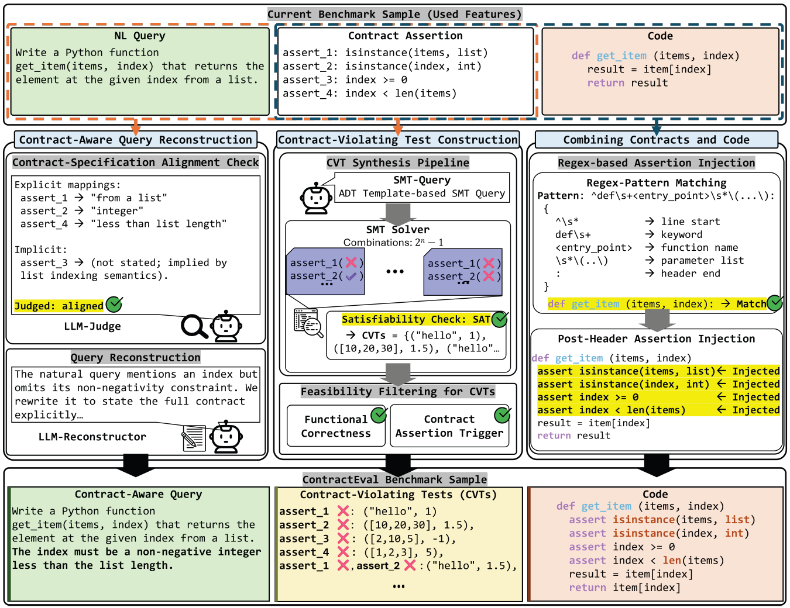

# ContractEval: A Benchmark for Evaluating Contract-Satisfying Assertions in Code Generation

<p align="center">
  <a href="https://github.com/suhanmen/ContractEval/stargazers">
    
  </a>
  <a href="https://github.com/suhanmen/ContractEval/commits/main">
    
  </a>
  <a href="https://github.com/suhanmen/ContractEval/graphs/contributors">
    
  </a>
</p>

<div align="center">
    <a href="https://arxiv.org/abs/2510.12047"><b>Paper Link</b>📖</a>
</div><br>


## 📰 News
- 📢 NEW! ContractEval is accepted to **ACL 2026 (Findings)**. 🎉 (Apr 7, 2026)
- 📢 NEW! **"ContractEval: A Benchmark for Evaluating Contract-Satisfying Assertions in Code Generation"** has been updated on arXiv. (Jan 8, 2026)
- 📢 NEW! The official **ContractEval** Benchmark has been released on GitHub. (Jan 8, 2026)


## 🔍 Motivation
Large Language Models can generate working code—but can they generate safe code? **ContractEval** goes beyond pass@k accuracy to ask a deeper question: “Does the model respect the rules of the program?” By testing how models handle invalid inputs and preconditions, ContractEval reveals hidden weaknesses in existing benchmarks and provides a new standard for contract-aware code evaluation.

## ✨ About ContractEval
<p align="center">
  
</p>


**ContractEval** is a novel benchmark for evaluating contract adherence in LLM-generated code.
Unlike traditional benchmarks that measure only *functional correctness* through *pass@k* on well-formed inputs, ContractEval systematically assesses whether generated programs respect preconditions and input validation rules (contracts).

Built on HumanEval+ and MBPP+, ContractEval augments each task with **SMT-verified contract-violating tests (CVTs)** and **contract-adherence metrics (AVC, TS, CSR)**, providing the first principled benchmark for measuring how reliably LLMs enforce contracts in code generation.

The above figure illustrates the ContractEval construction pipeline, which extends each HumanEval+/MBPP+ task through three stages: Contract-Aware Query Reconstruction, Contract-Violating Test Construction, and Combining Contracts and Code.

## 🚀 What makes ContractEval valuable?
✅ **Introduces contract awareness as a new evaluation perspective** – ContractEval shifts the focus from pure *functional correctness* to whether LLMs understand and respect **contracts**, such as preconditions and input constraints.  

✅ **Defines novel and interpretable metrics for contract adherence** – ContractEval introduces new metrics — **AVC** and **TS** for test case generation, and **CSR** for code generation — to rigorously measure how well models detect and enforce contracts in both test generation and code generation.  

✅ **Reveals hidden weaknesses in existing benchmarks** – Through systematic experiments on **HumanEval+** and **MBPP+**, ContractEval uncovers that many “functionally correct” programs fail to enforce basic contracts, and demonstrates how contract-violating test cases substantially improve robustness.


## 📈 Results
<b>Comparison of contract-violating test cases generated by o4-mini and by ContractEval (ours)</b>

| Method              |   AVC (↑)  |   TS (↑)   | Average (↑) |
| :------------------ | :--------: | :--------: | :---------: |
| o4-mini             | **97.58%** |   72.69%   |    85.13%   |
| ContractEval (ours) |   94.11%   | **84.92%** |  **89.52%** |

<b>Functional correctness and contract satisfaction in code generation</b>

| Model           | Instruction |  pass@1 (↑)  |    CSR (↑)   | CodeBLEU (↑) | LLM-as-judge (↑) |
| :-------------- | :---------- | :--------: | :--------: | :--------: | :------------: |
| **DeepSeek-R1** | Standard    | **80.81%** |    0.00%   |    0.00%   |      0.00%     |
|                 | CS          |   73.29%   |   27.24%   |   34.29%   |     53.05%     |
|                 | EAS         |   70.87%   | **52.66%** | **54.51%** |   **81.49%**   |
| **gemma-3**     | Standard    | **81.76%** |    0.00%   |    0.00%   |      0.00%     |
|                 | CS          |   74.75%   |   22.69%   |   29.97%   |     41.74%     |
|                 | EAS         |   69.56%   | **48.54%** | **48.88%** |   **72.04%**   |
| **Phi-4**       | Standard    | **75.39%** |    0.00%   |    0.00%   |      0.00%     |
|                 | CS          |   71.29%   |   40.71%   |   46.66%   |     69.33%     |
|                 | EAS         |   72.99%   | **50.73%** | **50.86%** |   **75.63%**   |
| **Phi-4-plus**  | Standard    | **75.97%** |    0.00%   |    0.00%   |      0.00%     |
|                 | CS          |   70.83%   |   38.24%   |   44.38%   |     65.31%     |
|                 | EAS         |   73.21%   | **50.94%** | **51.04%** |   **75.98%**   |
| **Qwen-3**      | Standard    | **74.79%** |    0.00%   |    0.00%   |      0.00%     |
|                 | CS          |   70.62%   |   24.29%   |   35.05%   |     49.71%     |
|                 | EAS         |   69.65%   | **51.83%** | **53.30%** |   **77.27%**   |

Our comprehensive evaluation across 5 LLMs (DeepSeek-R1, gemma-3, Phi-4, Phi-4-plus, Qwen-3) on HumanEval+ and MBPP+ reveals several key findings:

* **Contract-aware test generation** – ContractEval’s two-stage LLM + SMT solver pipeline produces logically consistent contract-violating test cases (CVTs), achieving a +12.23 pp improvement in Target Specificity (TS) over direct LLM generation (o4-mini) while maintaining high Assert Violation Capture (AVC). This demonstrates the precision of ContractEval’s targeted violation generation approach.

* **Prompting strategy matters** – Augmenting the Contract Specification (CS) prompt with CVTs (Example-Augmented Specification, EAS) boosted contract satisfaction rate (CSR) by an average of +20.3 pp across all models. Concrete examples help LLMs explicitly learn how to enforce contracts.

* **The importance of contract awareness** – Our results reveal a critical gap: Standard prompting achieves high pass@1 scores (74.79%–81.76%) but completely fails to enforce contracts (CSR: 0.00% across all models). In contrast, contract-aware prompting (EAS) achieves substantial contract satisfaction (CSR: 48.54%–52.66%) while maintaining reasonable functional correctness (pass@1: 69.56%–73.21%). This demonstrates that contract enforcement is a distinct dimension of code quality that must be explicitly evaluated and optimized, rather than being assumed to emerge from functional correctness alone.

For detailed quantitative results and case analyses, please refer to our paper.


## 🛠️ Setup
### Datasets
The datasets used in this research are available in the data/ directory:
* `HumanEvalPlus.jsonl` — A benchmark dataset consisting of 164 programming problems, used end-to-end for CVT generation and code-generation evaluation. Version **v0.1.1** was used in our experiments.
* `MBPPPlus.jsonl` — A benchmark dataset consisting of 378 programming problems, used end-to-end for CVT generation and code-generation evaluation. Version **v0.2.0** was used in our experiments.


## ⚡ Quickstart
The following scripts guide you through running ContractEval step by step:

### **Step 1: Clone the Repository**
~~~shell
git clone https://github.com/suhanmen/ContractEval.git
cd ContractEval
~~~

### **Step 2: Set up the environment**
~~~shell
conda env create --file setting/environment.yaml
conda activate ContractEval
~~~

### **Step 3: CVTs Generation**
~~~shell
### STEP 1: Generation
sh ./scripts/generation_gpt/gpt_main.sh

### STEP 2: Parsing
#### Default
sh ./scripts/utils/inference_parsing.sh

### STEP 3: SMT Solver
sh ./scripts/utils/grammar_smt_tool_gpt_format.sh

### STEP 4: Evaluation (pass@k)
sh ./scripts/utils/evaluation_test_case_pass_k.sh

### STEP 5: Evaluation (our CVTs)
sh ./scripts/utils/evaluation_test_case_pass_k_for_grammar.sh
~~~
This stage executes the full **contract-violating test-case (CVT) generation and evaluation pipeline**.  
Each script performs the following functions:  
- **Generation:** Produces initial test cases based on natural-language contract descriptions.  
- **Parsing:** Converts the raw model outputs into a standardized JSON format.  
- **SMT Solver:** Validates the logical consistency of generated cases using the **Z3 solver**.  
- **Evaluation (pass@k):** Measures baseline functional correctness of the generated tests.  
- **Evaluation (our CVTs):** Computes **AVC** (Assert Violation Capture) and **TS** (Target Specificity), the proposed metrics for evaluating the quality of contract-violating test cases.  

Each script in this stage supports **detailed configuration options** that can be adjusted within the corresponding shell files.


### **Step 4: Code Generation**
~~~shell
### STEP 1: Generation
sh ./scripts/generation_test_case_or_code_generation/main.sh

### STEP 2: Evaluation (code generation)
sh ./scripts/utils/evaluation_code_generation.sh
~~~
This stage executes the **contract-aware code generation and evaluation pipeline** using the CVTs generated in Step 3.  
The scripts perform the following functions:  
- **Generation:** Produces code solutions under two prompting settings:
  - **Contract Specification (CS)** (baseline)
  - **Example-Augmented Specification (EAS)** (augmented with CVTs).  
- **Evaluation:** Assesses generated code for both functionality and contract adherence using the proposed metrics: **CSR** (Contract Satisfaction Rate), **CodeBLEU**, and **LLM-as-judge**, which measure how effectively the model enforces and aligns with contracts.  

Each script in this stage supports **detailed configuration options** that can be adjusted within the corresponding shell files.

## 🔖 Citation
```bibtex
@misc{lim2026contractevalbenchmarkevaluatingcontractsatisfying,
      title={ContractEval: A Benchmark for Evaluating Contract-Satisfying Assertions in Code Generation}, 
      author={Soohan Lim and Joonghyuk Hahn and Hyunwoo Park and Sang-Ki Ko and Yo-Sub Han},
      year={2026},
      eprint={2510.12047},
      archivePrefix={arXiv},
      primaryClass={cs.AI},
      url={https://arxiv.org/abs/2510.12047}, 
}
```
응 